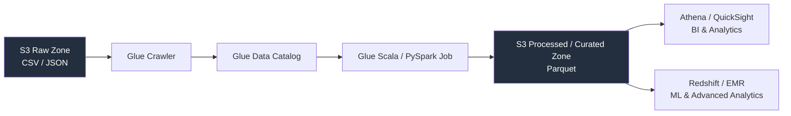

# scala-learn
Here’s a **professional, visually appealing, recruiter-friendly** version of your README.md for the **AWS Glue Scala ETL Pipeline** project.

It includes:
- Modern badges (using shields.io)
- Clean structure with emojis
- Mermaid architecture diagram (GitHub renders it natively)
- Code blocks with proper highlighting
- Better formatting for tables, lists, and sections
- Subtle call-to-action at the bottom

```markdown
<div align="center">

  <h1>📊 AWS Glue Scala ETL Pipeline</h1>

  <p>
    <strong>Serverless ETL processing of customer purchase data using AWS Glue + Apache Spark (Scala)</strong><br>
    Clean, transform, enrich, and aggregate raw CSV → optimized Parquet in S3
  </p>

  <!-- Badges -->
  <p>
    
    
    
    
    
  </p>

  <br>

  
  
  

</div>

## Table of Contents

- [Project Overview](#-project-overview)
- [Architecture](#-architecture)
- [Technologies Used](#-technologies-used)
- [Dataset Structure](#-dataset-structure)
- [ETL Workflow & Transformations](#-etl-workflow--transformations)
- [AWS Glue Scala Script](#-aws-glue-scala-script)
- [Step-by-Step Setup](#-step-by-step-setup)
- [Running the Job & Output](#-running-the-job--output)
- [Common Errors & Fixes](#-common-errors--fixes)
- [Future Improvements](#-future-improvements)
- [Real-World Architecture Vision](#-real-world-architecture-vision)
- [Author](#-author)

## 🚀 Project Overview

Serverless **ETL pipeline** built with **AWS Glue** (Scala + Spark) that:

1. Reads raw customer purchase CSV from **Amazon S3**
2. Cleans missing values
3. Engineers new features (e.g., Salary Category)
4. Performs city-level aggregations
5. Writes optimized **Parquet** files back to S3

Ideal for batch processing customer analytics data in a cost-effective, scalable way.

## 🏗 Architecture

```mermaid
flowchart TD
    A[Raw CSV in S3\nscala-glue-data/raw/] -->|Read| B[AWS Glue Job\nScala + Spark]
    B -->|Clean & Fill NaN| C[Handle Missing Values]
    C -->|Feature Engineering| D[Add Salary_Category]
    D -->|Group & Aggregate| E[City-level Analytics\nAvg Purchase + Total Customers]
    E -->|Write Parquet\nmode=overwrite| F[Processed Data in S3\nscala-glue-data/processed/]
    subgraph "Monitoring"
        B --> G[Amazon CloudWatch Logs & Metrics]
    end
    style A fill:#232f3e,stroke:#ff9900
    style F fill:#232f3e,stroke:#569a31
```



## 🧰 Technologies Used

| Technology       | Purpose                        | Icon/Link                                      |
|------------------|--------------------------------|------------------------------------------------|
| AWS Glue         | Managed Spark ETL service      |  |
| Amazon S3        | Raw & processed data storage   |  |
| Apache Spark     | Distributed data processing    |  |
| Scala            | Job implementation language    |  |
| Parquet          | Columnar storage format        | Columnar & compression                         |
| CloudWatch       | Job monitoring & logs          | AWS logging                                    |

## 📂 Dataset Structure

**Sample columns**:

| Column          | Description                  | Type    | Example              |
|-----------------|------------------------------|---------|----------------------|
| Customer_ID     | Unique customer ID           | Int     | 1                    |
| Name            | Customer name                | String  | Customer_1           |
| Age             | Age                          | Int     | 56                   |
| City            | City                         | String  | Delhi                |
| Salary          | Annual income                | Int     | 85733                |
| Purchase_Amount | Transaction value            | Int     | 2665                 |
| Payment_Method  | Payment type                 | String  | UPI                  |
| Rating          | Satisfaction rating          | Int     | 2                    |

**Example raw row**:

```csv
1,Customer_1,56,Delhi,85733,2665,UPI,2
2,Customer_2,,Chennai,54698,1160,Card,2
```

## 🔄 ETL Workflow & Transformations

1. **Load** → CSV → Spark DataFrame
2. **Clean** → Fill missing values
   - Age → 30
   - City → "Unknown"
   - Salary → 0
   - Payment_Method → "Unknown"
3. **Enrich** → Add `Salary_Category`
   - > 80,000 → "High"
   - > 50,000 → "Medium"
   - Else → "Low"
4. **Aggregate** → Group by City
   - `avg(Purchase_Amount)` → Avg_Purchase
   - `count(Customer_ID)` → Total_Customers
5. **Write** → Parquet to S3 (overwrite mode)

## 💻 AWS Glue Scala ETL Script

```scala
import org.apache.spark.sql.SparkSession
import org.apache.spark.sql.functions._

object GlueApp {
  def main(sysArgs: Array[String]): Unit = {
    val spark = SparkSession.builder().getOrCreate()

    // 1. Read raw CSV from S3
    val df = spark.read
      .option("header", "true")
      .option("inferSchema", "true")
      .csv("s3://scala-glue-data/raw/sample_dataset.csv")

    // 2. Clean missing values
    val cleanedDF = df.na.fill(Map(
      "Age"           -> 30,
      "City"          -> "Unknown",
      "Salary"        -> 0,
      "Payment_Method"-> "Unknown"
    ))

    // 3. Feature engineering
    val enrichedDF = cleanedDF.withColumn(
      "Salary_Category",
      when(col("Salary") > 80000, "High")
        .when(col("Salary") > 50000, "Medium")
        .otherwise("Low")
    )

    // 4. Aggregation
    val cityAnalytics = enrichedDF.groupBy("City").agg(
      avg("Purchase_Amount").alias("Avg_Purchase"),
      count("Customer_ID").alias("Total_Customers")
    )

    // Optional: preview in logs
    cityAnalytics.show()

    // 5. Write processed data as Parquet
    cityAnalytics.write
      .mode("overwrite")
      .parquet("s3://scala-glue-data/processed/")
  }
}
```

## ⚙️ Step-by-Step Setup

1. Create S3 bucket `scala-glue-data` with folders:
   - `raw/` → upload `sample_dataset.csv`
   - `processed/` (will be created automatically)
   - `scripts/` → upload the `.scala` file

2. In AWS Glue → Create job
   - Type: Spark
   - Language: Scala
   - Glue version: 4.0 (recommended) or 5.0
   - Worker type: G.1X (or scale as needed)
   - Script path: `s3://scala-glue-data/scripts/scala_job.scala`

3. Assign IAM role with:
   - S3 read/write on the bucket
   - Glue service permissions
   - CloudWatch Logs (optional but recommended)

4. Run job → monitor in CloudWatch Logs

## 📦 Output Results

- Location: `s3://scala-glue-data/processed/`
- Format: Parquet (partitioned if large)
- Files: `part-*.parquet`, `_SUCCESS`

Perfect for querying later with **Athena**, **Redshift Spectrum**, or Spark.

## ⚠️ Common Errors & Fixes

| Error                                      | Cause                              | Fix                                                                 |
|--------------------------------------------|------------------------------------|---------------------------------------------------------------------|
| `expected class or object definition`      | Missing `object` wrapper           | Wrap code in `object GlueApp { def main(...): Unit = { ... } }`     |
| `AccessDenied` on S3                       | IAM role permissions               | Add `s3:GetObject`, `s3:PutObject`, `s3:ListBucket`                 |
| `cloudwatch:PutMetricData not authorized`  | Missing CloudWatch perms           | Attach `cloudwatch:PutMetricData` to role                           |
| Job fails on schema inference              | Inconsistent CSV                   | Add `.option("mode", "DROPMALFORMED")` or clean source data         |

## 📈 Future Improvements

- Add **Glue Crawler** → auto schema in Data Catalog
- Query results with **Amazon Athena**
- Load to **Redshift** / **RDS** for BI
- Add data quality checks (Great Expectations / Deequ)
- Parameterize job (DynamicFrames, job bookmarks)
- Real-time variant with **Kafka + Glue streaming**

## 🏭 Real-World Data Engineering Architecture



## 👨‍💻 Author

**Ankit Kumar singh**  
B.Tech – Computer Science  
Data Engineering | Spark | AWS | ML Enthusiast  


Built with passion for scalable, serverless data pipelines.

---

Happy ETL-ing! 🚀
```

### Optional extras you can add later:

- Upload a project screenshot / output `.show()` table as image → ``
- Add GitHub stats if it's part of your profile repo
- Link to a Medium article / demo video if you have one

This version looks clean, modern, and very strong in a portfolio or resume link. Let me know if you want:

- Dark-mode optimized colors
- More badges
- CI/CD section (e.g., Glue job via IaC)
- PySpark version side-by-side

Good luck — this will impress recruiters!
